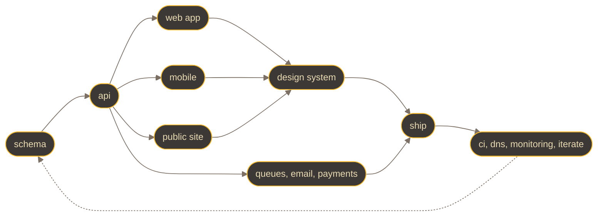

<a href="https://moncef.net">moncef.net</a> &nbsp;·&nbsp;
<a href="https://mochir.com">mochir.com</a> &nbsp;·&nbsp;
<a href="https://selance.com">selance.com</a> &nbsp;·&nbsp;
<a href="https://madeinalgeria.dev">madeinalgeria.dev</a>

### what i actually do

I am not the person you hand one layer to. I take a product from the first migration to the live domain: data model, API, dashboard, marketing site, mobile app, emails, CI, DNS, and the monitoring after it ships.

### range

<table>
<tr><td><b>languages</b></td><td>TypeScript, Rust, Go, C, Python, SQL</td></tr>
<tr><td><b>frontend</b></td><td>React, Next.js, Astro, design systems and tokens, animation, accessibility, performance budgets, RTL and bilingual UI</td></tr>
<tr><td><b>mobile</b></td><td>React Native, Expo, native builds and store releases</td></tr>
<tr><td><b>backend</b></td><td>Node, Bun, Hono, Postgres and schema design, Redis, queues and background jobs, REST, tRPC, GraphQL, auth systems, Stripe</td></tr>
<tr><td><b>infra</b></td><td>Cloudflare Workers, D1, KV, Docker, CI/CD, Linux and VPS, Nginx, AWS, GCP, observability, DNS and email deliverability</td></tr>
<tr><td><b>ai</b></td><td>LLM applications, RAG, agents and tool use, embeddings and vector search, scraping and automation pipelines</td></tr>
</table>

### building

<table>
<tr>
<td width="180"><a href="https://madeinalgeria.dev"><b>Made in Algeria</b></a></td>
<td>A bilingual directory of software built in Algeria. Static site, two APIs, admin review queue, newsletter and campaign mail. Arabic and RTL front to back.</td>
</tr>
<tr>
<td><a href="https://mochir.com"><b>Mochir</b></a></td>
<td><!-- one line: what it is --></td>
</tr>
<tr>
<td><a href="https://selance.com"><b>Selance</b></a></td>
<td>Product studio. Client products shipped on the same pipeline, first migration to production domain.</td>
</tr>
<tr>
<td><a href="https://moncef.net"><b>moncef.net</b></a></td>
<td>Personal site and writing.</td>
</tr>
</table>

### how i build

Real module boundaries, contracts between modules instead of imports across them. Validation schemas shared by the API and every client, so a response shape cannot silently drift. Pagination that ships with its index and its query plan. Tests against the real runtime with real migrations, not mocks. Design tokens in one file, so a rebrand is one file edited and one page reviewed.

### open to work

Freelance and contract. Product builds, edge and serverless architecture, mobile, AI features, Arabic and RTL products.

<a href="mailto:moncef@mochir.com">moncef@mochir.com</a> &nbsp;·&nbsp;
<a href="https://x.com/moncefais">x</a> &nbsp;·&nbsp;
<a href="https://www.linkedin.com/in/moncef-aissaoui/">linkedin</a>

(👉ﾟヮﾟ)👉

