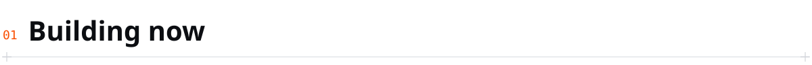
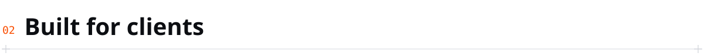
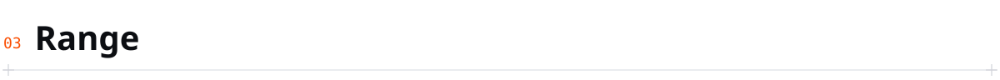
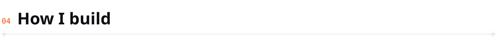
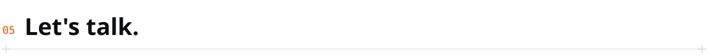
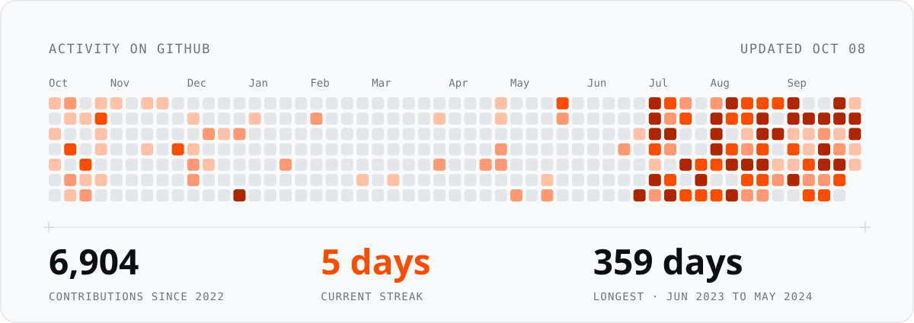

<!-- Drawn in moncef.net's design: scripts/build.py draws the header and section heads, scripts/activity.py the activity card (daily, .github/workflows/activity.yml). -->

<a href="https://www.moncef.net/en/">
<picture>
  <source media="(prefers-color-scheme: dark)" srcset="./assets/header-dark.svg" />
  
</picture>
</a>

<a href="mailto:moncef@selance.com"><b>Email me</b></a> &nbsp;·&nbsp;
<a href="https://www.moncef.net/en/book">Book a call</a> &nbsp;·&nbsp;
<a href="https://www.moncef.net/en/">moncef.net</a> &nbsp;·&nbsp;
<a href="https://www.linkedin.com/in/moncef-aissaoui-62a486269/">LinkedIn</a> &nbsp;·&nbsp;
<a href="https://twitter.com/moncefais">X</a>

 

<picture>
  <source media="(prefers-color-scheme: dark)" srcset="./assets/01-building-now-dark.svg" />
  
</picture>

<table width="100%">
<tr>
<td width="190"><b>Selance</b></td>
<td>My studio: websites, online stores and apps for the Gulf and Algeria.</td>
<td width="170" align="right"><a href="https://www.selance.com/"><code>selance.com</code>&nbsp;↗</a></td>
</tr>
<tr>
<td width="190"><b>Mochir</b></td>
<td>An AI business directory for Algeria.</td>
<td width="170" align="right"><a href="https://www.mochir.com/"><code>mochir.com</code>&nbsp;↗</a></td>
</tr>
<tr>
<td width="190"><b>Kayen</b></td>
<td>A community platform for Algerian builders.</td>
<td width="170" align="right"><a href="https://kayen.dev/"><code>kayen.dev</code>&nbsp;↗</a></td>
</tr>
<tr>
<td width="190"><b>ak7l</b></td>
<td>An online store from a single sentence.</td>
<td width="170" align="right"><a href="https://ak7l.com/"><code>ak7l.com</code>&nbsp;↗</a></td>
</tr>
<tr>
<td width="190"><b>Najmoo</b></td>
<td>Learning games for primary school teachers.</td>
<td width="170" align="right"><a href="https://najmoo.com/"><code>najmoo.com</code>&nbsp;↗</a></td>
</tr>
<tr>
<td width="190"><b>Made in Algeria</b></td>
<td>The directory of Algerian open source.</td>
<td width="170" align="right"><a href="https://madeinalgeria.dev/"><code>madeinalgeria.dev</code>&nbsp;↗</a></td>
</tr>
</table>

 

<picture>
  <source media="(prefers-color-scheme: dark)" srcset="./assets/02-built-for-clients-dark.svg" />
  
</picture>

<table width="100%">
<tr>
<td width="190"><b>TMR Construction</b></td>
<td>The website of a design and build firm in Algeria.</td>
<td width="170" align="right"><a href="https://www.sarltmr.com/"><code>sarltmr.com</code>&nbsp;↗</a></td>
</tr>
<tr>
<td width="190"><b>El Rouqa</b></td>
<td>A games guide with reviews, for a gaming creator.</td>
<td width="170" align="right"><a href="https://elrouqa.com/"><code>elrouqa.com</code>&nbsp;↗</a></td>
</tr>
<tr>
<td width="190"><b>Esnam</b></td>
<td>The website of a Saudi real estate developer.</td>
<td width="170" align="right"><a href="https://www.esnam.com.sa/"><code>esnam.com.sa</code>&nbsp;↗</a></td>
</tr>
</table>

 

<picture>
  <source media="(prefers-color-scheme: dark)" srcset="./assets/03-range-dark.svg" />
  
</picture>

<table width="100%">
<tr><td width="190"><code>LANGUAGES</code></td><td>TypeScript, Rust, Go, C, Python, SQL</td></tr>
<tr><td><code>FRONTEND</code></td><td>React, Next.js, Astro, design systems and tokens, animation, accessibility, performance budgets, RTL and bilingual UI</td></tr>
<tr><td><code>MOBILE</code></td><td>React Native, Expo, native builds and store releases</td></tr>
<tr><td><code>BACKEND</code></td><td>Node, Bun, Hono, Postgres and schema design, Redis, queues and background jobs, REST, tRPC, GraphQL, auth, Stripe</td></tr>
<tr><td><code>INFRA</code></td><td>Cloudflare Workers, D1, KV, Docker, CI/CD, Linux and VPS, Nginx, AWS, GCP, observability, DNS and email deliverability</td></tr>
<tr><td><code>AI</code></td><td>LLM applications, RAG, agents and tool use, embeddings and vector search, scraping and automation pipelines</td></tr>
</table>

 

<picture>
  <source media="(prefers-color-scheme: dark)" srcset="./assets/04-how-i-build-dark.svg" />
  
</picture>

I take a product from the first migration to the live domain: data model, API, dashboard, marketing site, mobile app, emails, CI, DNS, and the monitoring after it ships.

Real module boundaries, with contracts between modules instead of imports across them. Validation schemas shared by the API and every client, so a response shape cannot silently drift. Tests against the real runtime with real migrations, not mocks. Design tokens in one file, so a rebrand is one file edited and one page reviewed.

 

<picture>
  <source media="(prefers-color-scheme: dark)" srcset="./assets/05-lets-talk-dark.svg" />
  
</picture>

Have a project in mind? Write to me directly, or ask [Selance](https://www.selance.com/) for a written quote. Freelance and contract: product builds, edge and serverless architecture, mobile, AI features, Arabic and RTL products.

<a href="mailto:moncef@selance.com"><b>moncef@selance.com</b></a> &nbsp;·&nbsp;
<a href="https://www.moncef.net/en/book">Book a call, 30 min or 1 hour</a>

 

<picture>
  <source media="(prefers-color-scheme: dark)" srcset="./assets/activity-dark.svg" />
  
</picture>
